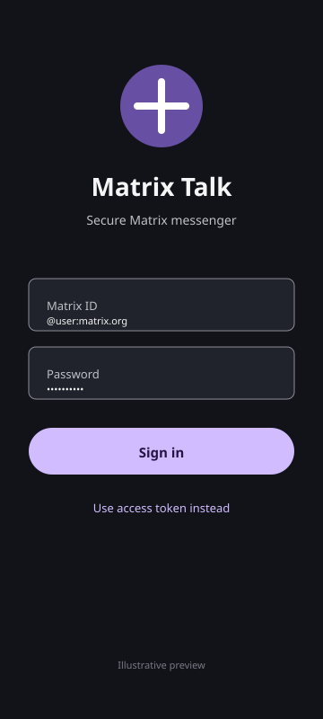
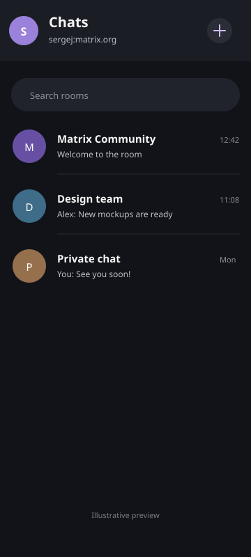
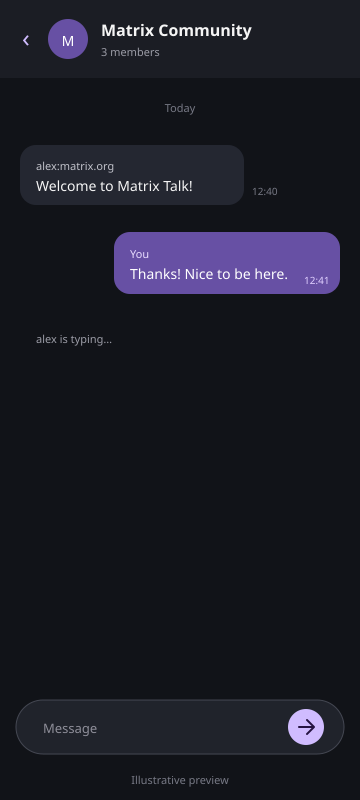

# Matrix Talk for Android

Android-клиент Matrix Talk для децентрализованной сети Matrix, написанный на Kotlin с использованием Jetpack Compose.

## Возможности

### 💬 Мессенджер
- ✅ Вход в аккаунт Matrix по логину и паролю
- ✅ Вход по Matrix access token
- ✅ Список чатов/комнат
- ✅ Отправка текстовых сообщений
- ✅ Отправка изображений, видео, аудио и файлов
- ✅ Индикатор набора текста
- ✅ Реакции на сообщения
- ✅ Редактирование сообщений
- ✅ Удаление сообщений
- ✅ Изменение display name и аватара
- ✅ Прямые чаты (DM)
- ✅ Групповые комнаты
- ✅ Поддержка нескольких серверов
- ✅ Material Design 3
- ✅ Тёмная тема

### 📞 Аудио-видео звонки (VoIP)
- ✅ Исходящие и входящие аудио-звонки
- ✅ Исходящие и входящие видео-звонки
- ✅ Полноэкранный входящий звонок поверх заблокированного экрана
- ✅ Управление микрофоном (mute/unmute)
- ✅ Управление камерой (вкл/выкл)
- ✅ Переключение фронтальной/задней камеры
- ✅ Переключение динамика
- ✅ Foreground Service для поддержания звонка в фоне
- ✅ Уведомления с кнопками «Принять», «Отклонить», «Завершить»
- ✅ Таймер длительности звонка
- ✅ Анимированный UI с пульсацией аватара при вызове

### 📁 Передача файлов
- ✅ Отправка изображений, видео, аудио и файлов
- ✅ Предпросмотр видео в чате
- ✅ Прогресс-бар загрузки/скачивания файлов
- ✅ Поддержка Drag-and-Drop для файлов

## Мосты Telegram, WhatsApp и Signal

В приложение добавлен экран настройки мостов, доступный по значку ссылки на экране чатов. Серверная заготовка для Synapse, PostgreSQL и mautrix-мостов находится в `docker-compose.bridges.yml`, а полная инструкция — в `docs/bridges.md`.

Мосты работают на собственном Matrix homeserver и требуют отдельной настройки. Приложение не подключает внешние мессенджеры напрямую и не хранит их токены.

## Скриншоты интерфейса

Ниже приведены демонстрационные изображения интерфейса Matrix Talk. Они созданы как иллюстрация экранов без подключения к Matrix-серверу; фактическое содержимое чатов и имена пользователей будут зависеть от вашей учётной записи.

  
  
  

## Технологии

| Компонент | Технология |
|-----------|-----------|
| **Язык** | Kotlin |
| **UI** | Jetpack Compose + Material 3 |
| **Архитектура** | MVVM + Clean Architecture |
| **DI** | Hilt |
| **Matrix SDK** | matrix-android-sdk2 1.6.62 |
| **Навигация** | Navigation Compose |
| **Корутины** | kotlinx.coroutines |
| **Flow** | StateFlow, Channel |
| **Звонки** | WebRTC (stream-webrtc-android 1.0.0) |
| **Загрузка изображений** | Coil 2.7.0 |
| **Предпросмотр видео** | Coil Video 2.7.0 |
| **Разрешения** | Accompanist Permissions 0.32.0 |
| **БД** | Room 2.6.1 |
| **Хранилище** | DataStore Preferences 1.1.1 |
| **Безопасность** | AndroidX Security Crypto 1.1.0-alpha06 |
| **Сеть** | OkHttp 4.12.0, Retrofit 2.9.0 |

## Структура проекта

<pre>
app/
├── src/main/
│   ├── java/com/matrix/messenger/
│   │   ├── data/
│   │   │   ├── model/          # Модели данных (Message, CallState, CallSession)
│   │   │   └── repository/     # Репозитории (ChatRepository, CallRepository)
│   │   ├── di/                 # Dependency Injection (Hilt modules)
│   │   ├── service/            # Foreground Services (CallService)
│   │   │
│   │   └── ui/
│   │       ├── call/           # Экраны звонков
│   │       │   ├── CallScreen.kt           # Compose UI экрана звонка
│   │       │   ├── CallActivity.kt         # Activity для активного звонка
│   │       │   ├── IncomingCallActivity.kt # Activity для входящего звонка
│   │       │   └── CallViewModel.kt        # ViewModel для звонков
│   │       ├── chat/           # Экран чата (ChatScreen, ChatViewModel)
│   │       ├── home/           # Список чатов (HomeScreen, HomeViewModel)
│   │       ├── login/          # Экран входа (LoginScreen, LoginViewModel)
│   │       ├── navigation/     # Навигация (NavGraph, Screen)
│   │       └── theme/          # Тема (Color, Theme, Type)
│   └── res/                    # Ресурсы Android
</pre>

## Сборка и запуск

### Требования

- Android Studio Ladybug (2024.2.1) или новее
- JDK 17
- Android SDK 35
- Эмулятор или устройство с Android 7.0+ (API 24)

### Шаги

1. Откройте проект в Android Studio
2. Дождитесь синхронизации Gradle
3. Запустите на эмуляторе или устройстве

**Windows:**

    .\gradlew.bat assembleDebug
    .\gradlew.bat installDebug
    .\gradlew.bat test
    .\gradlew.bat assembleRelease

**Linux/macOS:**

    chmod +x gradlew build.sh
    ./build.sh
    ./gradlew test
    ./gradlew assembleDebug
    ./gradlew assembleRelease

`local.properties` создаётся локально и намеренно не добавляется в Git.

Release APK создаётся по адресу `app/build/outputs/apk/release/app-release-unsigned.apk`. Это unsigned APK для тестирования. Для публикации в Google Play его необходимо подписать собственным keystore; ключи и пароли нельзя добавлять в репозиторий.

## Аудио-видео звонки

Matrix Talk поддерживает VoIP-звонки через WebRTC:

- **Аудио-звонки** — кнопка 📞 в AppBar чата
- **Видео-звонки** — кнопка 📹 в AppBar чата
- **Входящие звонки** — полноэкранный экран поверх заблокированного устройства
- **Управление** — mute микрофона, вкл/выкл видео, переключение камеры, динамик

> ⚠️ Звонки требуют разрешений на камеру и микрофон. Приложение запрашивает их при первом звонке. Для работы на Android 14+ (API 34) используются Foreground Service с типами `camera`, `microphone` и `phoneCall`.

## Настройка

### Домашний сервер

По умолчанию используется `matrix.org`. Вы можете изменить его на экране входа.

Популярные серверы:
- `matrix.org` — публичный сервер
- `mozilla.org` — сервер Mozilla
- `gnome.org` — сервер GNOME

### Безопасность

- E2EE (End-to-End Encryption) поддерживается через Matrix SDK
- Не добавляйте в репозиторий access token, keystore или другие секреты
- Access token вводится локально и не хранится в исходном коде
- Поддержка Cross-Signing зависит от возможностей Matrix SDK и сервера

## Статус проекта

Проект находится в активной разработке.

| Функция | Статус |
|---------|--------|
| Вход (логин/пароль, токен) | ✅ Реализовано |
| Список комнат и чатов | ✅ Реализовано |
| Обмен текстовыми сообщениями | ✅ Реализовано |
| Отправка медиа и файлов | ✅ Реализовано |
| Реакции, редактирование, удаление | ✅ Реализовано |
| Аудио-видео звонки | ✅ Реализовано |
| Мосты (Telegram, WhatsApp, Signal) | ✅ Настройка через сервер |
| Push-уведомления | 🔜 В разработке |
| Регистрация пользователя | 🔜 В разработке |
| E2EE (шифрование) | 🔜 Зависит от SDK |

## GitHub Actions

Workflow `android.yml` запускает тесты, собирает Debug и Release APK на каждый push и pull request, а Release APK публикуется как GitHub Actions artifact.

## Лицензия

Apache License 2.0

## Ссылки

- [Matrix.org](https://matrix.org)
- [Matrix Android SDK](https://github.com/element-hq/matrix-android)
- [Jetpack Compose](https://developer.android.com/jetpack/compose)
- [Material Design 3](https://m3.material.io)
- [Stream WebRTC Android](https://github.com/GetStream/stream-webrtc-android)